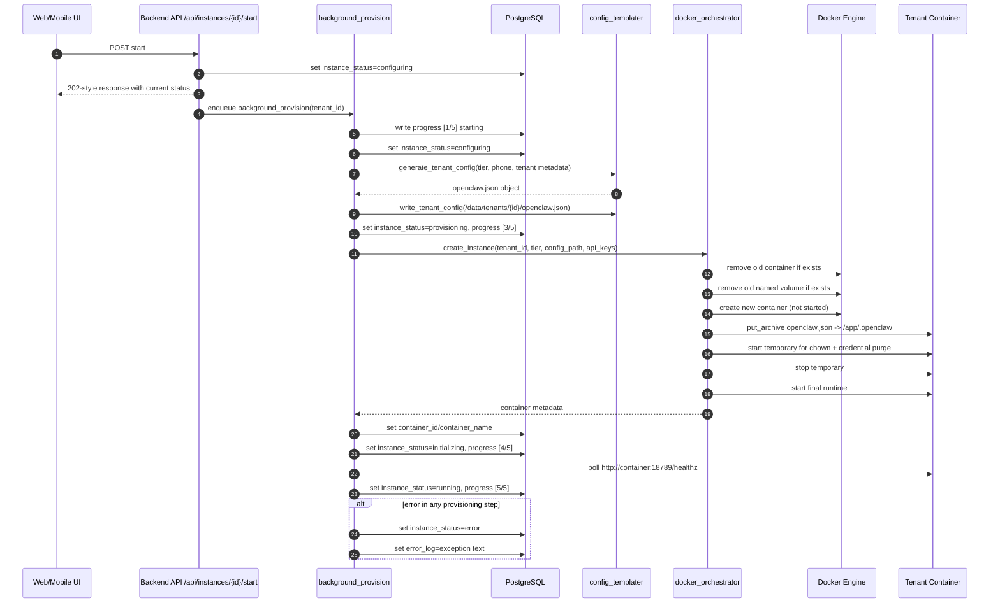
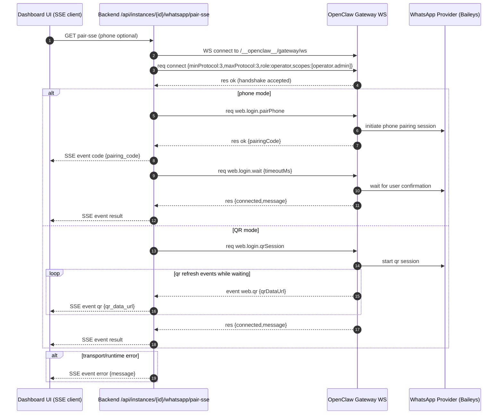
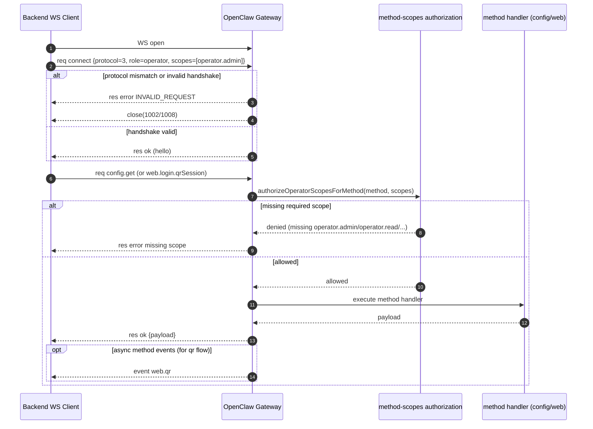

# Pleiades Stack Summary

> Last updated: 2026-03-31

---

## 1. Backend Control Plane — `pleiades.backend/`

**Purpose**: Multi-tenant orchestration backend. Manages user auth, tenant subscriptions, OpenClaw container provisioning, knowledge base, MCP tool gateway, and WhatsApp pairing.

### 1.1 Tech Stack

| Layer | Technology |
|---|---|
| Language | Python 3.11+ |
| Framework | FastAPI ≥0.115 + Uvicorn |
| ORM | SQLAlchemy 2.x |
| Migrations | Alembic |
| Database | PostgreSQL 16 (docker-compose) / SQLite (local dev) |
| Container orchestration | Docker SDK for Python |
| Reverse proxy | Traefik v3.2 |
| Auth | JWT HS256 (7-day tokens) + bcrypt (passlib) |
| HTTP client | httpx ≥0.27 |
| WebSocket | websockets ≥13.0 |
| File parsing | pypdf, python-docx, python-pptx |
| Settings | pydantic-settings (`.env` file) |

### 1.2 Directory Layout

```
pleiades.backend/
├── app/
│   ├── main.py              # FastAPI app entry + lifespan + admin seed
│   ├── config.py            # pydantic-settings (env vars)
│   ├── security.py          # JWT + bcrypt helpers
│   ├── db/                  # SQLAlchemy engine, sessionmaker, Base
│   ├── models/
│   │   ├── user.py          # User (email, role, plan, tenant_id, profile_json)
│   │   ├── tenant.py        # Tenant + SubscriptionTier + InstanceStatus enums
│   │   ├── dashboard.py     # DashboardConfig + DashboardConfigProposal
│   │   ├── knowledge.py     # Document + Chunk + KnowledgeAuditLog
│   │   ├── mcp.py           # McpServiceCredential + McpAuditLog
│   │   └── unity_surface.py # UnityServiceCredential + UnitySession + UnityTurn
│   ├── routes/
│   │   ├── auth.py          # /api/auth/*   (register, login, me)
│   │   ├── users.py         # /api/users/*  (CRUD, profile, plan)
│   │   ├── tenants.py       # /api/tenants/* (CRUD)
│   │   ├── instances.py     # /api/instances/* (start/stop/delete/status/logs/whatsapp/api-keys)
│   │   ├── knowledge.py     # /api/kb/*     (ingest, upload, search, docs, audit)
│   │   ├── mcp.py           # /v1/mcp/*     (MCP tool call gateway)
│   │   └── unity_surface.py # /api/surfaces/unity/* (Unity bridge + sessions + import + ws)
│   ├── services/
│   │   ├── docker_orchestrator.py  # DockerOrchestrator (create/stop/start/delete containers)
│   │   ├── config_templater.py     # Generate/write openclaw.json for tenant
│   │   ├── knowledge_service.py    # Ingest + search Postgres full-text (tsvector)
│   │   └── knowledge_file_parser.py # Extract text from PDF/DOCX/PPTX/TXT/MD/CSV
│   └── scripts/             # Utility scripts
├── migrations/              # Alembic migration versions
├── templates/               # HTML templates (if any)
├── Dockerfile               # python:3.11-slim, pip install, uvicorn
├── docker-compose.yml       # traefik + postgres + backend
├── requirements.txt         # Python deps
├── alembic.ini
└── .env                     # Environment variables (DO NOT PASTE VALUES)
```

### 1.3 Database Schema

#### `users` Table
| Column | Type | Notes |
|---|---|---|
| id | Integer (PK) | Auto-increment |
| email | String (unique, indexed) | Login identifier |
| hashed_password | String | bcrypt hash |
| role | String | `"user"` or `"admin"` |
| plan | String (nullable) | `"free"`, `"pro"`, `"enterprise"`, or `null` |
| is_onboarded | Integer | `0` or `1` |
| profile_json | Text (nullable) | JSON: name, org, preferredName, purpose, goals, behavior |
| tenant_id | FK → tenants.id | Membership binding |

#### `tenants` Table
| Column | Type | Notes |
|---|---|---|
| id | Integer (PK) | Auto-increment |
| name | String | Display name |
| owner_id | FK → users.id | Owner user |
| email | String (unique, indexed) | Tenant email |
| phone | String (nullable) | WhatsApp number |
| tier | Enum | `starter` / `growth` / `enterprise` |
| container_id | String | Docker container short ID |
| container_name | String | e.g. `pleiades-tenant-42` |
| instance_status | Enum | `pending`/`configuring`/`provisioning`/`initializing`/`running`/`stopping`/`stopped`/`error` |
| instance_port | Integer | Debug port mapping |
| error_log | String | Latest status/error message |
| api_keys | String (nullable) | JSON of AI provider keys |
| messages_today | Integer | Daily counter |
| total_messages | Integer | Lifetime counter |
| api_cost_usd | Float | Cost tracking |
| created_at | DateTime | UTC |
| updated_at | DateTime | UTC |

#### `documents` Table (Knowledge Base)
| Column | Type | Notes |
|---|---|---|
| id | Integer (PK) | |
| tenant_id | Integer | Scoped to tenant |
| source_type | String | `"local"`, `"upload"`, etc. |
| path_or_url | String | Source path or `upload://filename` |
| title | String | Display title |
| version | String | Version string |

#### `chunks` Table (Knowledge Base)
| Column | Type | Notes |
|---|---|---|
| id | Integer (PK) | |
| tenant_id | Integer | Scoped to tenant |
| document_id | FK → documents.id | |
| chunk_index | Integer | Ordering |
| text | Text | Chunk content |
| tsvector | TSVector | Full-text search index |

#### `dashboard_configs` / `dashboard_config_proposals` Tables
Versioned tenant-scoped dashboard schemas with proposal/approval workflow (HMAC-signed approval tokens).

#### `mcp_service_credentials` / `mcp_audit_logs` Tables
Service credentials for MCP tool access (HMAC-hashed API keys, per-credential rate limits, allowed tool lists).

### 1.4 API Reference

#### Auth (`/api/auth/`)
| Method | Path | Auth | Description |
|---|---|---|---|
| POST | `/api/auth/register` | — | Register new user |
| POST | `/api/auth/login` | — | Login (OAuth2 form), returns JWT |
| GET | `/api/auth/me` | Bearer | Current user info |

#### Users (`/api/users/`)
| Method | Path | Auth | Description |
|---|---|---|---|
| GET | `/api/users/me` | Bearer | My details |
| GET | `/api/users/me/profile` | Bearer | My profile |
| PATCH | `/api/users/me` | Bearer | Update my plan |
| PATCH | `/api/users/me/profile` | Bearer | Update profile (marks onboarded) |
| GET | `/api/users/` | Admin | List all users |
| POST | `/api/users/` | Admin | Create user |
| PATCH | `/api/users/{id}` | Admin | Update user role/plan/tenant/password |
| DELETE | `/api/users/{id}` | Admin | Delete user |

#### Tenants (`/api/tenants/`)
| Method | Path | Auth | Description |
|---|---|---|---|
| GET | `/api/tenants/me` | Bearer | My tenant record |
| POST | `/api/tenants/` | Bearer | Create tenant |
| GET | `/api/tenants/` | Bearer | List tenants (scoped) |
| GET | `/api/tenants/{id}` | Bearer | Get tenant |
| DELETE | `/api/tenants/{id}` | Bearer | Delete tenant + destroy container |

#### Instances (`/api/instances/`)
| Method | Path | Auth | Description |
|---|---|---|---|
| POST | `/api/instances/{id}/start` | Bearer | Provision & start container (background) |
| POST | `/api/instances/{id}/stop` | Bearer | Stop container |
| DELETE | `/api/instances/{id}` | Bearer | Permanently remove container |
| GET | `/api/instances/{id}/status` | Bearer | Live Docker status |
| GET | `/api/instances/{id}/logs` | Bearer | Container logs (tail N) |
| GET | `/api/instances/` | Bearer (admin) | List all tenant containers |
| PUT | `/api/instances/{id}/api-keys` | Bearer | Store AI provider keys |
| GET | `/api/instances/{id}/whatsapp/pair` | Bearer | Get WhatsApp QR code |
| GET | `/api/instances/{id}/whatsapp/pair-phone` | Bearer | Get phone pairing code |
| GET | `/api/instances/{id}/whatsapp/pair-wait` | Bearer | Long-poll wait for pairing |
| GET | `/api/instances/{id}/whatsapp/pair-sse` | Bearer | SSE stream (QR or phone flow) |
| GET | `/api/instances/{id}/config` | Bearer | Read openclaw.json from container |
| PUT | `/api/instances/{id}/config` | Bearer | Update openclaw.json (hash-guarded) |
| GET | `/api/instances/{id}/user-profile` | Bearer | Read USER.md from container |
| PUT | `/api/instances/{id}/user-profile` | Bearer | Write USER.md to container |
| POST | `/api/instances/{id}/update` | Bearer | Pull image and recreate (preserved data) |
| POST | `/api/instances/update-all` | Admin | Rolling update for all tenants |
| POST | `/api/instances/{id}/whatsapp/logout` | Bearer | Clear WhatsApp credentials via gateway |

#### Knowledge Base (`/api/kb/`)
| Method | Path | Auth | Description |
|---|---|---|---|
| POST | `/api/kb/ingest` | Admin | JSON document ingestion |
| POST | `/api/kb/upload` | Admin | File upload (PDF/DOCX/PPTX/TXT/MD/CSV) |
| GET | `/api/kb/search` | Bearer | Full-text search with citations |
| GET | `/api/kb/docs` | Bearer | List documents |
| GET | `/api/kb/docs/{id}` | Bearer | Document detail + content |
| DELETE | `/api/kb/docs/{id}` | Admin | Delete document |
| GET | `/api/kb/audit` | Bearer | Search audit log |
| GET | `/api/kb/audit/stats` | Bearer | Search statistics |
| GET | `/api/kb/rpc/search` | Internal | Agent-facing search (no JWT, Docker network only) |

#### MCP Gateway (`/v1/mcp/`)
| Method | Path | Auth | Description |
|---|---|---|---|
| GET | `/v1/mcp/tools` | MCP | List available MCP tools |
| POST | `/v1/mcp/call` | MCP | Execute an MCP tool |

**MCP Auth**: Bearer JWT **or** `X-MCP-API-Key` header (service credential).

**Available MCP Tools**:
| Tool | Description |
|---|---|
| `tenant.get_context` | Tenant-scoped context (id, plan, limits, allowlist) |
| `docs.search` | Search tenant knowledge base |
| `metrics.query` | Time-series metrics (mcp.tool_calls, kb.searches) |
| `dashboard.get_schema` | Get latest dashboard schema |
| `dashboard.propose_schema` | Propose schema change (returns approval token) |
| `dashboard.apply_schema` | Apply approved schema change |

#### Unity Surface (`/api/surfaces/unity/`)
| Method | Path | Auth | Description |
|---|---|---|---|
| POST | `/api/surfaces/unity/credentials` | Bearer (tenant member or admin) | Create tenant-scoped Unity API key (one-time reveal) |
| POST | `/api/surfaces/unity/session` | `X-Unity-API-Key` | Create or resume Unity session (`resume_existing` defaults to true) |
| POST | `/api/surfaces/unity/session/new` | `X-Unity-API-Key` | Force-create new session (Unity equivalent of `/new`) |
| GET | `/api/surfaces/unity/sessions` | `X-Unity-API-Key` | List recent sessions by tenant, optional `player_id` filter |
| POST | `/api/surfaces/unity/chat` | `X-Unity-API-Key` | Send user message through OpenClaw gateway and return text/cues |
| POST | `/api/surfaces/unity/history/import` | `X-Unity-API-Key` | Import prior conversation turns into a target session |
| WS | `/api/surfaces/unity/ws` | `X-Unity-API-Key` | Session event stream (`run.*`, `assistant.*`, `tool.*`, `error`) |

### 1.5 Environment Variables (names only)

| Variable | Purpose |
|---|---|
| `DATABASE_URL` | PostgreSQL connection string |
| `OPENCLAW_IMAGE` | Docker image for tenant containers |
| `TENANT_DATA_DIR` | Host path for tenant data |
| `DOCKER_NETWORK` | Shared Docker network name |
| `BASE_DOMAIN` | Domain for Traefik routing (e.g. `pleiades.ai`) |
| `SECRET_KEY` | JWT signing key |
| `MCP_API_KEY_SALT` | HMAC salt for MCP service credentials |
| `UNITY_API_KEY_SALT` | HMAC salt for Unity service credentials (fallbacks to `MCP_API_KEY_SALT`) |
| `DASHBOARD_APPROVAL_SALT` | HMAC salt for dashboard schema approval |
| `POSTGRES_PASSWORD` | Postgres password |
| `OPENROUTER_API_KEY` | Default AI provider key (injected into containers) |
| `OPENAI_API_KEY` | Optional OpenAI key |
| `GOOGLE_API_KEY` | Optional Google AI key |
| `SEED_ADMIN_ON_STARTUP` | Enable admin bootstrap (`true`/`false`) |
| `SEED_ADMIN_EMAIL` | Bootstrap admin email |
| `SEED_ADMIN_PASSWORD` | Bootstrap admin password |
| `STARTER_RATE_LIMIT` | Rate limit for starter tier (req/min) |
| `GROWTH_RATE_LIMIT` | Rate limit for growth tier (req/min) |
| `MCP_RATE_LIMIT_PER_MINUTE` | MCP endpoint rate limit |

### 1.6 Docker Compose Services

```yaml
services:
  traefik:    # Traefik v3.2 — ports 8081(http), 8443(https), 8080(dashboard)
  postgres:   # PostgreSQL 16 — internal pleiades-net only
  backend:    # FastAPI — port 8000, Host(`api.pleiades.ai`)

networks:
  pleiades-net:  # External bridge network (shared with tenant containers)

volumes:
  traefik-certs, backend-data, tenant-data, postgres-data
```

### 1.7 Provisioning Flow (5 steps, background task)

1. **Starting** — Clear previous errors
2. **Configuring** — Generate `openclaw.json` via `config_templater`
3. **Provisioning** — Create Docker container (via `docker_orchestrator`)
   - Remove old container + volume (idempotent)
   - Create container with tier-based resource limits
   - Inject `openclaw.json` via tarball
   - Fix volume ownership (`chown 1000:1000`)
   - Purge stale WhatsApp credentials
4. **Initializing** — Poll `/healthz` until gateway responds (max 150s)
5. **Running** — Instance ready

---

## 2. Web Frontend — `pleiades.web/`

**Purpose**: Next.js marketing site + authenticated dashboard/admin for managing tenants and agents.

### 2.1 Tech Stack

| Layer | Technology |
|---|---|
| Framework | Next.js 16.1.6 (App Router) |
| UI Library | React 19.2.3 |
| Styling | Tailwind CSS v4 + tw-animate-css |
| Components | shadcn/ui (v3.8) + Radix UI |
| State | Zustand 5.x |
| HTTP | Axios |
| Icons | lucide-react |
| Dates | date-fns |
| Utility | clsx + tailwind-merge + class-variance-authority |
| Analytics | @vercel/analytics |
| Typography | Space Grotesk + Plus Jakarta Sans (Google Fonts) |
| SEO | JSON-LD structured data (Organization + Website schemas) |

### 2.2 Directory Layout

```
pleiades.web/
├── app/
│   ├── layout.tsx           # Root layout (fonts, SEO, analytics)
│   ├── globals.css          # Global styles
│   ├── (marketing)/         # Public pages (route group, no /marketing prefix)
│   │   ├── page.tsx         # Landing page (/)
│   │   ├── ai-coworker/     # AI co-worker info page
│   │   ├── article/         # Blog/article page
│   │   ├── login/           # Login page
│   │   └── register/        # Register page
│   ├── admin/               # Admin dashboard pages
│   │   ├── dashboard/       # Admin overview
│   │   ├── instances/       # Instance management + WhatsApp pairing
│   │   ├── kb/              # Knowledge base management
│   │   ├── users/           # User management
│   │   └── config/          # System config
│   ├── api/                 # Next.js API routes (if any)
│   ├── dashboard/           # User dashboard
│   ├── my/
│   │   ├── dashboard/       # Personal dashboard
│   │   └── tenant/[id]/whatsapp/ # User WhatsApp pairing
│   ├── onboarding/          # Onboarding flow
│   ├── plan/                # Plan selection
│   ├── provisioning/        # Instance provisioning status
│   └── tenant/
│       ├── [id]/            # Tenant detail
│       └── create/          # Tenant creation
├── components/
│   ├── admin/               # Admin UI components
│   ├── marketing/           # Landing page components (ScrollProgress, etc.)
│   ├── providers/           # Context providers (LoadingProvider)
│   ├── seo/                 # SEO components (JsonLd)
│   ├── tenant/              # Tenant UI components
│   └── ui/                  # shadcn/ui base components
├── lib/
│   ├── auth.ts              # Auth token management (cookie key)
│   ├── store.ts             # Zustand global store (13.6 KB)
│   ├── backend-proxy.ts     # Backend API client/proxy
│   ├── gateway-client.ts    # OpenClaw gateway WebSocket client
│   ├── onboarding.ts        # Onboarding flow helpers
│   ├── tenant-utils.ts      # Tenant name/status helpers
│   ├── user-state.ts        # User state helpers
│   ├── article.ts           # Article/blog helpers
│   ├── seo.ts               # SEO config (SITE_NAME, SITE_URL, schemas)
│   ├── site-config.ts       # Site-wide config (14.8 KB)
│   └── utils.ts             # General utilities (cn helper etc.)
├── middleware.ts             # Route protection (cookie-based JWT check)
├── scripts/                 # Build/deploy scripts
├── public/                  # Static assets
├── package.json
├── next.config.ts
├── tsconfig.json
├── postcss.config.mjs
├── eslint.config.mjs
└── components.json          # shadcn/ui config
```

### 2.3 Route Protection (middleware.ts)

Protected paths requiring JWT cookie (`pleiades_auth_token`):
- `/dashboard`, `/admin/*`, `/my/*`, `/onboarding`, `/plan`, `/tenant/*`

Auth pages (`/login`, `/register`) redirect to `/dashboard` if already logged in.

### 2.4 Notable Env Vars

| Variable | Purpose |
|---|---|
| `NEXT_PUBLIC_BACKEND_URL` | Backend API base URL |

---

## 3. Mobile App — `pleiades.mobile/`

**Purpose**: Flutter mobile app for MSME customers. Chat-based interface to interact with AI agents via WhatsApp.

### 3.1 Tech Stack

| Layer | Technology |
|---|---|
| Framework | Flutter (Dart SDK ≥3.5) |
| State Management | flutter_riverpod 2.6 + riverpod_annotation |
| Code Generation | riverpod_generator + build_runner + json_serializable |
| Navigation | go_router 14.6 |
| HTTP | dio 5.7 |
| Secure Storage | flutter_secure_storage 9.2 |
| UI Animations | flutter_animate 4.5 + shimmer |
| Typography | google_fonts 6.2 |
| Images | cached_network_image |
| Icons | cupertino_icons + flutter_svg |
| i18n | intl 0.19 |

### 3.2 Directory Layout

```
pleiades.mobile/
├── lib/
│   ├── main.dart            # App entry point
│   ├── app.dart             # MaterialApp configuration
│   ├── router.dart          # GoRouter config (5 routes)
│   ├── config/              # App configuration
│   ├── models/              # Data models
│   ├── providers/           # Riverpod providers
│   ├── screens/
│   │   ├── splash_screen.dart           # Splash/loading screen
│   │   ├── auth/
│   │   │   ├── login_screen.dart        # Login
│   │   │   └── register_screen.dart     # Registration
│   │   ├── onboarding/
│   │   │   └── plan_selection_screen.dart # Plan selection
│   │   ├── provisioning/
│   │   │   └── instance_provisioning_screen.dart # Provisioning status
│   │   └── whatsapp/
│   │       └── whatsapp_pairing_screen.dart # WhatsApp pairing (QR/code)
│   ├── services/
│   │   ├── api_service.dart     # Backend API client (Dio)
│   │   └── storage_service.dart # Secure token storage
│   ├── theme/               # App theme config
│   └── widgets/             # Reusable UI widgets
├── android/                 # Android platform
├── ios/                     # iOS platform
├── pubspec.yaml
└── analysis_options.yaml
```

### 3.3 User Flow

```
Splash → Login/Register → Plan Selection → Instance Provisioning → WhatsApp Pairing
```

---

## 4. Agent Runtime (OpenClaw) — `thinclaw/`

**Purpose**: The AI agent runtime engine. Each tenant gets their own isolated Docker container running OpenClaw.

### 4.1 Tech Stack

| Layer | Technology |
|---|---|
| Runtime | Node.js |
| Language | TypeScript |
| Build | tsdown (tsdown.config.ts) |
| Monorepo | pnpm workspace |
| Testing | Vitest (unit, e2e, gateway, live, extensions) |
| Linting | oxlint + ESLint + Prettier |
| Docker | Multi-stage Dockerfile (main + sandbox + sandbox-browser) |

### 4.2 Core Modules (`thinclaw/src/`)

| Directory | Purpose |
|---|---|
| `agents/` | Agent definition and execution |
| `gateway/` | WebSocket gateway server (port 18789) |
| `channels/` | Messaging channel adapters |
| `whatsapp/` | WhatsApp (Baileys) integration |
| `line/` | LINE messaging integration |
| `providers/` | AI model providers |
| `sessions/` | User session management |
| `memory/` | Conversation memory store |
| `context-engine/` | Context assembly for prompts |
| `routing/` | Message routing logic |
| `plugins/` | Plugin system |
| `plugin-sdk/` | Plugin development SDK |
| `cron/` | Scheduled task execution |
| `hooks/` | Lifecycle hooks |
| `auto-reply/` | Auto-reply rules |
| `browser/` | Browser automation |
| `web-search/` | Web search capabilities |
| `image-generation/` | Image generation tools |
| `tts/` | Text-to-speech |
| `media/` | Media handling |
| `media-understanding/` | Media analysis (vision) |
| `link-understanding/` | URL/link analysis |
| `markdown/` | Markdown processing |
| `logging/` | Logging infrastructure |
| `secrets/` | Secret management |
| `security/` | Security utilities |
| `config/` | Configuration management |
| `cli/` | Command-line interface |
| `interactive/` | Interactive/REPL mode |
| `terminal/` | Terminal UI |
| `tui/` | Text UI components |
| `wizard/` | Setup wizard |
| `pairing/` | Device pairing flow |
| `acp/` | Agent Communication Protocol |
| `infra/` | Infrastructure utilities |
| `process/` | Process management |
| `daemon/` | Background daemon |
| `bindings/` | Native bindings |
| `shared/` | Shared utilities |
| `types/` | TypeScript type definitions |
| `utils/` | General utilities |

### 4.3 Gateway Protocol

**WebSocket URL**: `ws://<host>:18789/__openclaw__/gateway/ws`
**Health check**: `GET http://<host>:18789/healthz`
**Protocol Version**: 3

Frame format:
```json
// Request
{"type": "req", "id": "<uuid>", "method": "...", "params": {...}}
// Response
{"type": "res", "id": "<uuid>", "ok": true/false, "payload": {...}, "error": {...}}
// Event
{"type": "event", "event": "...", "payload": {...}}
```

Connect handshake required before any RPC call:
```json
{"type": "req", "id": "<uuid>", "method": "connect", "params": {
  "minProtocol": 3, "maxProtocol": 3,
  "client": {"id": "...", "displayName": "...", "version": "...", "platform": "...", "mode": "..."},
  "caps": [], "role": "operator", "scopes": ["operator.admin"]
}}
```

**Key RPC Methods**:
| Method | Purpose |
|---|---|
| `connect` | Handshake (required first) |
| `web.login.start` | Start WhatsApp QR login |
| `web.login.qrSession` | Start QR session (QR arrives as event) |
| `web.login.pairPhone` | Start phone number pairing |
| `web.login.wait` | Wait for login completion |

**Events**:
| Event | Payload |
|---|---|
| `web.qr` | `{qrDataUrl: "data:image/png;base64,..."}` |

### 4.4 Container Configuration

Each tenant container runs with:
- **Image**: `pleiades/openclaw:latest`
- **Command**: `node openclaw.mjs gateway --allow-unconfigured --bind lan`
- **User**: `node` (UID 1000)
- **Volume**: Named volume at `/app/.openclaw` (persistent data)
- **Shared workspace**: `/root/.openclaw/workspace` → `/app/.openclaw/workspace` (rw)
- **Config file**: `/app/.openclaw/openclaw.json` (injected by backend)
- **Agent persona**: `/app/.openclaw/workspace/pleiades/AGENT.md` (injected by backend)
- **User profile**: `/app/.openclaw/workspace/pleiades/USER.md`
- **Network**: `pleiades-net` (shared with backend + Traefik)

### 4.5 Resource Limits by Tier

| Tier | Memory | CPU Quota | Node.js Heap |
|---|---|---|---|
| Starter | 1.5 GB | 100% (1 core) | 1200 MB |
| Growth | 2 GB | 150% | 1800 MB |
| Enterprise | 3 GB | 200% (2 cores) | 2400 MB |

---

## 5. Deployment Procedures

### 5.1 Backend (VPS)

```bash
# SSH into VPS
cd ~/pleiades.backend

# Pull latest and rebuild
git pull
docker compose up -d --build

# Run migrations
docker compose exec backend alembic upgrade head

# Check status
docker compose ps
```

### 5.2 Frontend (Vercel)

**One-command script**: `scripts/deploy_web_vercel_pleiadesian.sh`

```bash
# On the VPS (script does all steps):
bash ~/openclaw/skills/pleiades-stack/scripts/deploy_web_vercel_pleiadesian.sh

# Manual steps if needed:
cd ~/pleiades.web && git pull
rsync -a --delete --exclude '.git/' --exclude 'node_modules/' --exclude '.next/' --exclude '.env*' --exclude '.vercel/' ~/pleiades.web/ ~/pleiades-prod/
cd ~/pleiades-prod
vercel pull --yes --environment=production
vercel build --prod
vercel deploy --prebuilt --prod
```

### 5.3 Tenant Container Rebuild

```bash
# Rebuild the OpenClaw image
cd ~/thinclaw
docker build -t pleiades/openclaw:latest .

# Re-provision a specific tenant (via API or dashboard)
# Stop → Delete → Start triggers fresh provision
```

### 5.4 Local Development

**Backend**:
```bash
cd pleiades.backend
python -m venv venv && source venv/bin/activate  # or .\venv\Scripts\activate  on Windows
pip install -r requirements.txt
# Use SQLite for local dev (default if DATABASE_URL not set to postgres)
uvicorn app.main:app --reload --port 8000
```

**Web**:
```bash
cd pleiades.web
npm install
npm run dev    # Next.js dev server
```

**Mobile**:
```bash
cd pleiades.mobile
flutter pub get
flutter run    # Launch on connected device/emulator
```

---

## 6. Network Architecture

```
┌─────────────────────────────────────────────────────────┐
│                     Docker Host (VPS)                    │
│                                                         │
│  ┌─────────┐   ┌──────────┐   ┌─────────────────────┐ │
│  │ Traefik │   │ Postgres │   │  Backend (FastAPI)   │ │
│  │ :80/443 │   │  :5432   │   │    :8000             │ │
│  │ :8080   │   │(internal)│   │ api.pleiades.ai      │ │
│  └────┬────┘   └──────────┘   └──────────┬───────────┘ │
│       │         pleiades-net              │             │
│       ├───────────────────────────────────┤             │
│       │                                   │             │
│  ┌────┴─────────┐      ┌────────────────┐│             │
│  │ tenant-1     │      │ tenant-N       ││             │
│  │ :18789       │      │ :18789         ││             │
│  │ OpenClaw     │ ...  │ OpenClaw       ││             │
│  │ debug:18001  │      │ debug:1800N    ││             │
│  └──────────────┘      └────────────────┘│             │
│                                           │             │
└───────────────────────────────────────────┘             │
                                                          │
  ┌───────────────┐                                       │
  │  Vercel (CDN) │    ← pleiades.web (Next.js)           │
  │  pleiadesian  │    calls backend via NEXT_PUBLIC_      │
  └───────────────┘    BACKEND_URL                        │
```

---

## 7. Security Considerations

- JWT tokens expire after **7 days** (`ACCESS_TOKEN_EXPIRE_MINUTES = 10080`)
- MCP API keys are **HMAC-SHA256 hashed** before storage (salt: `MCP_API_KEY_SALT`)
- Dashboard schema approvals use separate HMAC tokens (salt: `DASHBOARD_APPROVAL_SALT`)
- Tenant containers run as `node` user (UID 1000), not root
- Docker socket is mounted **read-only** into Traefik, **read-write** into backend
- CORS is currently `allow_origins=["*"]` (should be restricted for production)
- WhatsApp credentials are purged on re-provision to prevent 401 restart loops
- Internal KB RPC endpoint (`/api/kb/rpc/search`) has **no JWT auth** — relies on Docker network isolation

---

## 8. Backend Auth + Tenant Access (Implementation-Level)

This section captures behavior from live code paths, not only route tables.

### 8.1 JWT/Auth Behavior

- Token algorithm: `HS256`
- Token lifetime: 7 days (`ACCESS_TOKEN_EXPIRE_MINUTES = 10080`)
- Auth payload currently includes:
  - `sub` (email)
  - `role`
  - `exp`
- User lookup for protected routes is email-based (`sub` -> `users.email`).

Important model detail:
- `User.role` is a **string column**, not an enum.
- Route code must not assume `current_user.role.value` exists.

### 8.2 Tenant/User Ownership Model

- `tenants.owner_id` is the primary owner reference.
- `users.tenant_id` is membership binding (user belongs to tenant).
- A user can be tenant owner and/or tenant member depending on flow.

### 8.3 Access Rule Mismatch to Be Aware Of

There are currently two different access styles:

- `app/routes/tenants.py`
  - strict: admin OR `current_user.tenant_id == tenant_id`
- `app/routes/instances.py`
  - broader helper `_assert_tenant_access(...)` allows:
    - admin role
    - member (`current_user.tenant_id == tenant.id`)
    - owner (`tenant.owner_id == current_user.id`)
    - email fallback match (`tenant.email == current_user.email`, normalized)

When documenting or implementing Unity gateway auth, use one canonical policy and apply it consistently.

### 8.4 Known Auth Exposure Risk

Some instance lifecycle endpoints are currently declared without `get_current_user` dependency in code:

- `POST /api/instances/{tenant_id}/start`
- `POST /api/instances/{tenant_id}/stop`
- `DELETE /api/instances/{tenant_id}`
- `GET /api/instances/{tenant_id}/status`
- `GET /api/instances/{tenant_id}/logs`
- `GET /api/instances/`

Sensitive instance endpoints below those in the same module are protected (API keys, WhatsApp pairing, config, USER.md), so policy is mixed today.

---

## 9. Tenant Instance Provisioning Deep Dive

### 9.1 State Machine (`InstanceStatus`)

`pending -> configuring -> provisioning -> initializing -> running`

Error path:

- Any exception in background job sets:
  - `instance_status = error`
  - `error_log = str(exception)`

Operational transitions:

- `running -> stopping -> stopped`
- delete resets to:
  - `container_id = null`
  - `container_name = null`
  - `instance_status = pending`

### 9.2 Background Provision Flow (actual order)

1. Clear prior status/errors in DB (`[1/5] Starting provisioning...`).
2. Generate tenant OpenClaw config from template.
3. Write config to host path: `/data/tenants/{tenant_id}/openclaw.json`.
4. Create container via Docker SDK.
5. Mark container metadata on tenant (`container_id`, `container_name`).
6. Poll `http://{container_name}:18789/healthz` (max 150s).
7. Mark tenant as running.

### 9.3 Docker Orchestrator Behavior

When creating tenant instance:

- Name: `pleiades-tenant-{tenant_id}`
- Subdomain: `tenant-{tenant_id}.{BASE_DOMAIN}`
- Port mapping: `18789/tcp -> 18000 + tenant_id`
- Existing container cleanup attempted first (idempotency)
- Existing named volume cleanup attempted first (to avoid stale WhatsApp creds)

### 9.4 Volume and Mount Layout

- Named volume:
  - host: Docker volume `pleiades-tenant-{id}-data`
  - container mount: `/app/.openclaw`
- Shared bind mount:
  - host path: `/root/.openclaw/workspace`
  - container path: `/app/.openclaw/workspace`
  - mode: `rw`

---

## 10. OpenClaw Config Injection + Runtime Structure

### 10.1 Template Source and Generation

- Template source: `pleiades.backend/templates/openclaw_base.json`
- Runtime writer: `app/services/config_templater.py`
- Output path: `/data/tenants/{id}/openclaw.json`

Template adjustments performed per tenant:

- `agents.defaults.workspace = /root/.openclaw/workspace`
- Tier limits:
  - starter: lower `maxConcurrent` + reduced agent allowlist
  - growth/enterprise: larger concurrency budgets
- WhatsApp channel forced enabled
- Gateway forced:
  - `port = 18789`
  - `mode = local`
  - `bind = lan`
  - permissive control UI origin/auth switches
  - `auth.mode = none`

Sanitization/removals from base:

- `auth.profiles` emptied
- `channels.discord` removed
- `hooks`, `plugins`, `skills` removed

### 10.2 Container-Side Files You Will Touch Often

- Main runtime config:
  - `/app/.openclaw/openclaw.json`
- Shared workspace:
  - `/app/.openclaw/workspace/...`
- Tenant persona file managed by backend:
  - `/app/.openclaw/workspace/pleiades/AGENT.md`
- Tenant profile file managed by backend:
  - `/app/.openclaw/workspace/pleiades/USER.md`
- WhatsApp auth state (purged on reprovision):
  - `/app/.openclaw/credentials`
  - `/app/.openclaw/auth-state`

### 10.3 Config Injection Sequence in Orchestrator

1. Container is **created** (not started yet).
2. Config tar stream is built in memory.
3. `openclaw.json` is injected with `put_archive` into `/app/.openclaw`.
4. Container is briefly started for ownership fix:
  - `chown -R 1000:1000 /app/.openclaw`
  - cleanup credentials/auth-state
5. Container is stopped.
6. Container is started for normal runtime.

---

## 11. Gateway Protocol + Scope Model (Backend-Bridge View)

### 11.1 Protocol Contract

- OpenClaw gateway protocol version in thinclaw: `3`
- Backend route code hardcodes same protocol version and matches it in connect handshake.
- Handshake rule is strict: first frame on new WS connection must be `method = connect`.

### 11.2 Backend Gateway Client Behavior

Backend helper builds:

- WS URL: `ws://pleiades-tenant-{id}:18789/__openclaw__/gateway/ws`
- Connect params include:
  - `role: operator`
  - `scopes: ["operator.admin"]`

Then it performs one RPC per connection for commands like:

- `web.login.start`
- `web.login.qrSession`
- `web.login.pairPhone`
- `web.login.wait`
- `config.get`
- `config.set`
- `config.apply`

### 11.3 Scope Classification in OpenClaw

From thinclaw gateway scope tables:

- `config.*` methods are admin-scoped
- `web.login.*` methods are admin-scoped
- Default-deny behavior is used for unclassified methods

This means backend bridge calls that require these methods must continue presenting admin-level operator scope.

### 11.4 QR/Pairing Runtime Behavior

`web.login.qrSession` emits async `web.qr` events while session is in progress; final response indicates connected/timed-out state.

Backend exposes this in two forms:

- direct one-shot endpoints (`/pair`, `/pair-phone`, `/pair-wait`)
- SSE stream endpoint (`/pair-sse`) forwarding `qr`, `code`, `result`, `error` events

---

## 12. Endpoint Auth Matrix (Current Backend Code)

### 12.1 Protected by JWT (`get_current_user`)

- `/api/auth/me`
- All `/api/tenants/*` routes
- All `/api/instances/*` lifecycle and sensitive routes:
  - `/api/instances/{id}/start`
  - `/api/instances/{id}/stop`
  - `/api/instances/{id}` (delete)
  - `/api/instances/{id}/status`
  - `/api/instances/{id}/logs`
  - `/api/instances/` (admin check enforced)
  - `/api/instances/{id}/api-keys`
  - `/api/instances/{id}/whatsapp/*`
  - `/api/instances/{id}/config*`
  - `/api/instances/{id}/user-profile`

### 12.2 Notes

- Authorization behavior is now aligned with route dependencies in current backend code.
- Continue validating role normalization (`User.role` string vs enum-like values) when adding new access checks.

### 12.3 Unity Surface Auth Split (Current Behavior)

- Bearer protected with tenant policy:
  - `POST /api/surfaces/unity/credentials`
  - tenant member can create for own tenant
  - admin can create for any tenant
- Unity-key protected (`X-Unity-API-Key` required and tenant-bound):
  - `POST /api/surfaces/unity/session`
  - `POST /api/surfaces/unity/session/new`
  - `GET /api/surfaces/unity/sessions`
  - `POST /api/surfaces/unity/chat`
  - `POST /api/surfaces/unity/history/import`
  - `WS /api/surfaces/unity/ws`

Credential checks enforce:

- key exists and is active
- key hash matches stored credential
- credential tenant matches request tenant

---

## 13. Documentation and Integration Guidance

When updating docs, SDKs, or Unity gateway integration specs:

1. Distinguish desired security policy from current implementation.
2. Keep an explicit per-endpoint auth table (JWT required + scope required + tenant rule).
3. Specify tenant resolution order for every request path (token tenant_id, explicit tenant_id, owner fallback).
4. Keep protocol version coupling explicit (`backend OPENCLAW_PROTOCOL_VERSION == thinclaw PROTOCOL_VERSION`).
5. Document container filesystem contracts as stable integration points (`/app/.openclaw`, workspace paths, credentials paths).

Recommended next change set (code, not docs):

- Normalize access helper usage across tenants and instances modules.
- Add regression tests for unauthorized lifecycle operations.

---

## 14. Sequence Diagrams

### 14.1 Tenant Provisioning (Control Plane -> Docker -> OpenClaw)



### 14.2 WhatsApp Pairing via SSE (Single WS Session)



### 14.3 Gateway Connect Handshake and Method Authorization



Auth decision matrix (current behavior):

| Layer | Check | Pass Condition | Failure Outcome | Where Enforced |
|---|---|---|---|---|
| HTTP (backend) | JWT present and valid | Bearer token decodes and user exists | `401` / `403` before bridge call | FastAPI dependencies + route checks |
| Tenant authorization | Caller may access tenant | Admin, member, owner, or module-specific policy | `403` | Backend route helpers |
| Gateway handshake | Protocol compatibility | `minProtocol <= 3 <= maxProtocol` and valid `connect` frame | WS error + close (`1002`/`1008`) | OpenClaw ws message handler |
| Gateway role parse | Role accepted | `role=operator` (or valid role) | error `invalid role` + close | OpenClaw ws message handler |
| Method scope auth | Scope covers requested method | Scopes include required operator scope (often `operator.admin` for `config.*` and `web.login.*`) | `res error` missing scope | OpenClaw method-scopes authorization |
| Method params/schema | Params validate | Method-specific validator passes | `INVALID_REQUEST` with validation details | OpenClaw method handler |

Quick method scope map for backend bridge calls:

| Method group | Typical backend methods | Required gateway scope |
|---|---|---|
| Config management | `config.get`, `config.set`, `config.apply` | `operator.admin` |
| WhatsApp login | `web.login.start`, `web.login.pairPhone`, `web.login.wait`, `web.login.qrSession` | `operator.admin` |
| Read-only health/status (gateway side) | `health`, `channels.status`, `status` | `operator.read` (or `operator.admin`) |

### 14.4 Practical Notes for Integrators

- Pairing flows are stateful and should keep a single WS session per login attempt to match gateway expectations.
- Treat protocol version as a strict compatibility contract between backend bridge and gateway runtime.
- For Unity or other clients, keep auth and tenant checks explicit before opening bridge sessions to tenant containers.

---

## 15. Unity Surface Deep Dive (HTTP + WS Bridge)

This section documents the production Unity bridge behavior implemented in `app/routes/unity_surface.py`.

### 15.1 Data Model

- `unity_service_credentials`
  - tenant-scoped API key hash (`api_key_hash`)
  - active flag + last-used timestamp
- `unity_sessions`
  - external `session_id`
  - `tenant_id`, `player_id`
  - mapped `openclaw_session_key`
  - `metadata_json`, `last_active_at`
- `unity_turns`
  - persisted user/assistant/imported turns
  - trace and run metadata (`trace_id`, `run_id`, `latency_ms`)

### 15.2 Session Semantics

- `POST /session`
  - default `resume_existing = true`
  - returns latest session for same `(tenant_id, player_id)` when present
  - updates metadata and emits `session.resumed`
- `POST /session/new`
  - forces new session (`resume_existing = false`)
  - this is the Unity-side analog for a fresh `/new` conversation
- `GET /sessions`
  - supports `tenant_id`, optional `player_id`, `limit`
  - returns recent sessions ordered by activity

### 15.3 OpenClaw Session Key Strategy

- Unity sessions map to agent-compatible keys: `agent:main:unity:{player_id}` (sanitized)
- Legacy non-agent keys are auto-upgraded on resume
- This aligns Unity routing with dashboard/chat behavior and avoids no-reply edge cases tied to ad-hoc key formats

### 15.4 Chat Bridging Behavior

Gateway bridge flow for `/chat`:

1. Ensure tenant instance is running
2. Open WS to tenant gateway
3. Send `connect` handshake with operator admin scope
4. Send `chat.send` with mapped `sessionKey`
5. Stream events into Unity WS hub (`assistant.delta`, `assistant.final`, `tool.*`, `run.*`)
6. Persist assistant turn and return HTTP response with `text`, `cues`, `run_id`, `latency_ms`

Text extraction normalizes multiple gateway payload shapes, including:

- `message.text`
- `message.content[*].text`
- nested text/value variants
- top-level and choices-based fallbacks

### 15.5 History Import Behavior

`POST /history/import` imports history into an existing target Unity session.

Request supports:

- direct `messages[]`
- optional copy from stored source session turns (`source_session_id` + `include_stored_source_history`)

Gateway compatibility bootstrap:

1. try `sessions.create` with target key
2. if unavailable, fallback `sessions.reset(reason=new)`
3. then runtime-prime with `chat.send` `/new`
4. inject each message via `chat.inject`

Imported turns are also persisted into `unity_turns` with `status = imported`.

### 15.6 WS Telemetry Contract

`/api/surfaces/unity/ws` publishes session-scoped operational events:

- `connection.ready`
- `session.created` / `session.resumed`
- `run.started` / `run.completed`
- `assistant.delta` / `assistant.final`
- `tool.*`
- `instance.cold_start` / `instance.ready`
- `history.imported`
- `error`

---

## 16. Validated Integration Outcomes (Current)

Validated in live server tests during March 2026 rollout:

- Session persistence works for same `(tenant_id, player_id)` through `/session`
- Forced fresh session works through `/session/new`
- Unity chat returns non-empty assistant text on fresh sessions
- Session list endpoint returns active session inventory for Unity UI pickers
- History import works end-to-end after compatibility bootstrap updates
- Follow-up chat can reference imported memory in the same session
- Tenant-user credential creation works for own tenant and is denied for other tenants

Practical client flow:

1. create service credential (admin path)
2. open or create session (`/session` or `/session/new`)
3. optional history bootstrap (`/history/import`)
4. run conversation turns (`/chat`)
5. subscribe to telemetry (`/ws`) and refresh session picker (`/sessions`)
